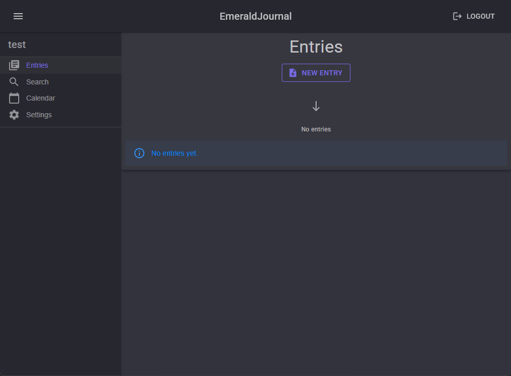
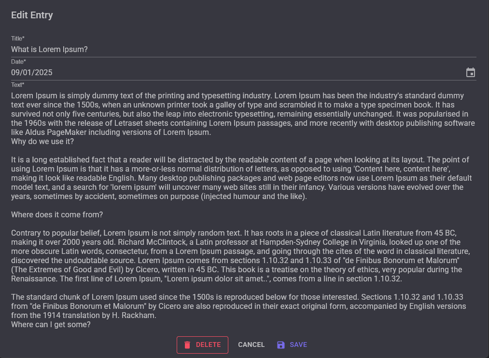
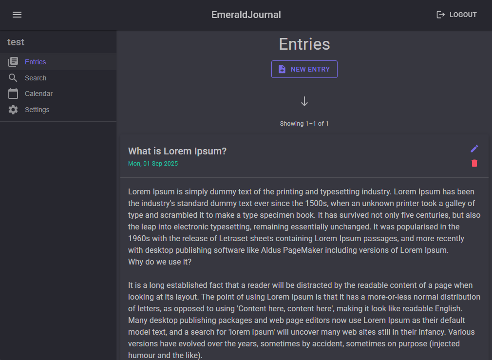
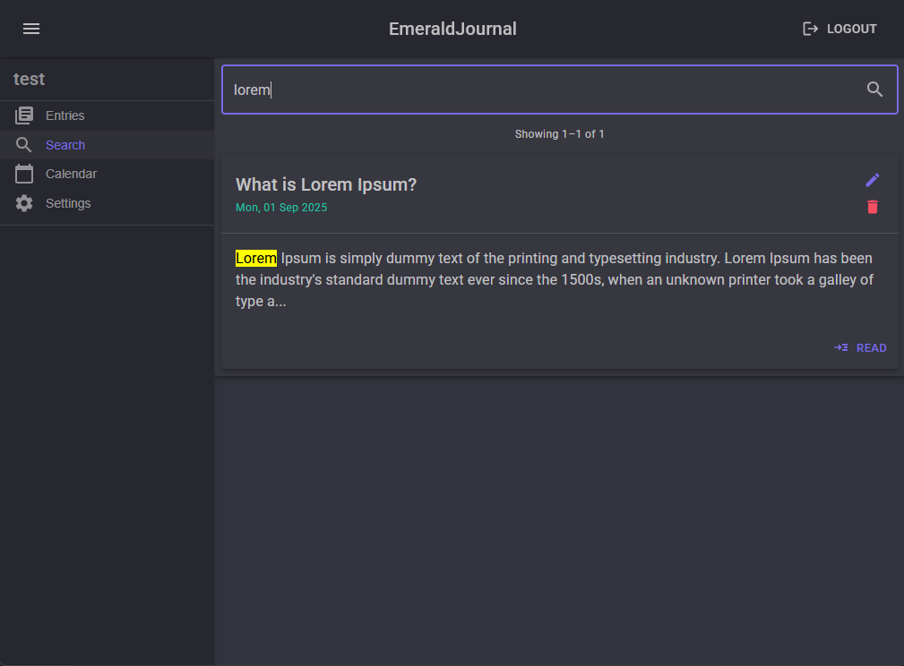
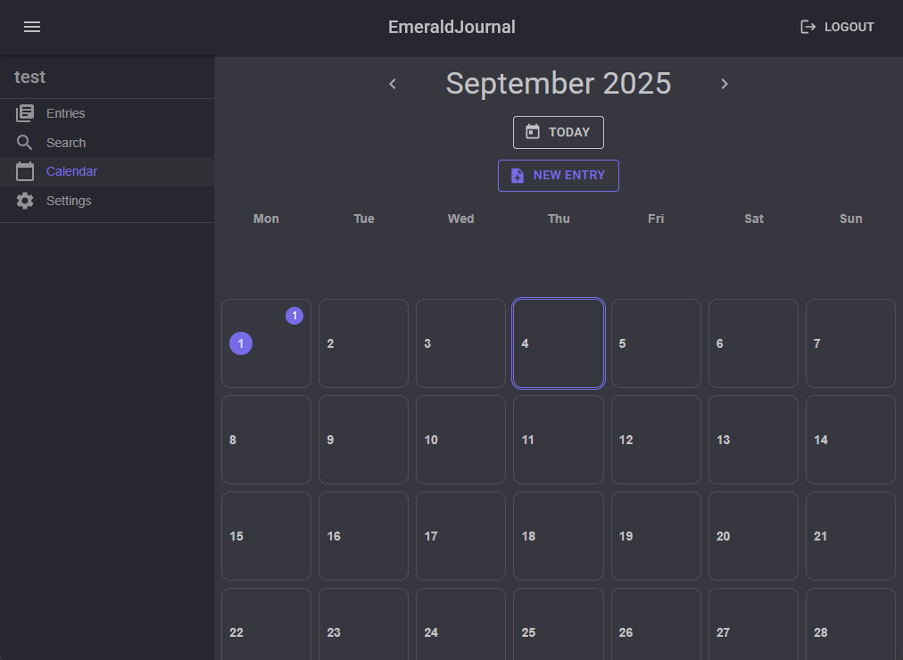
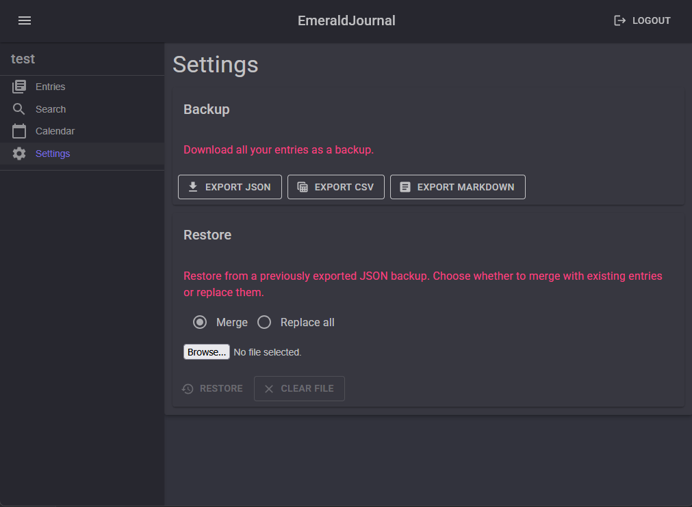

# EmeraldJournal

A clean, personal and mobile-friendly **Blazor Server** journaling app built with **MudBlazor** and **EF Core**.  
Write entries, browse by calendar, search with debounce + pagination, and back up or restore your data (JSON/CSV/Markdown).

This is a personal project built primarily for learning and experimentation.

## Highlights

- ✍️ **Entries**: create, edit, delete; mobile-friendly full-screen editor with draft autosave.
- 📆 **Calendar**: month grid with entry counts, “today” indicator, quick create via double-click/tap.
- 🔎 **Search**: title/content search with debounce, highlighted snippets, server-side pagination.
- 👁️ **Viewer**: full-screen dialog with prev/next navigation and mobile swipe.
- 💾 **Backup & Restore** (Settings):
  - Export **JSON**, **CSV**, or **Markdown ZIP** (one `.md` per entry)
  - Auto-generated `README.md` links to all entries; each entry links back + prev/next
  - Restore **Merge** or **Replace all**, with a summary report
- 🔐 **Per-user data** via ASP.NET Identity (each user only sees their own entries).

## Tech Stack

- **Blazor Server** (.NET 7/8)
- **MudBlazor** UI
- **EF Core** (SQLite / SQL Server — configurable)
- ASP.NET **Identity**

## Quickstart

```bash
# Run with hot reload
dotnet watch
```

Open the app, register/login, and start journaling.
 The database is created automatically on first run.

## Publish / Run

Create a Release build:

```bash
dotnet publish -c Release -o ./publish
```

Run it (example):

```bash
cd publish
dotnet EmeraldJournal.dll --urls=http://0.0.0.0:SERVERPORT
```

## VS Code

VS Code **tasks** and **launch** settings are included:

- **Build/Watch** via `Tasks: Run Task…`
- Press **F5** to launch with the provided `launch.json`.

## Screenshots

> Place screenshots in `docs/images/` (rename your current `READMEImages` folder to this).

| Empty state                           | Editor                          | Entry view                           |
| ------------------------------------- | ------------------------------- | ------------------------------------ |
|  |  |  |

| Search                            | Calendar                              | Settings                              |
| --------------------------------- | ------------------------------------- | ------------------------------------- |
|  |  |  |

## Security & Privacy

- Uses ASP.NET Identity for per-user isolation.
- Backups contain your content in plain text formats — store them securely.

## AI Assistance Disclaimer

Significant portions of this project were developed with the help of AI tools (e.g., ChatGPT/Copilot).
 All changes were reviewed and integrated by a human, but mistakes may remain.

## License

MIT — see `LICENSE`.